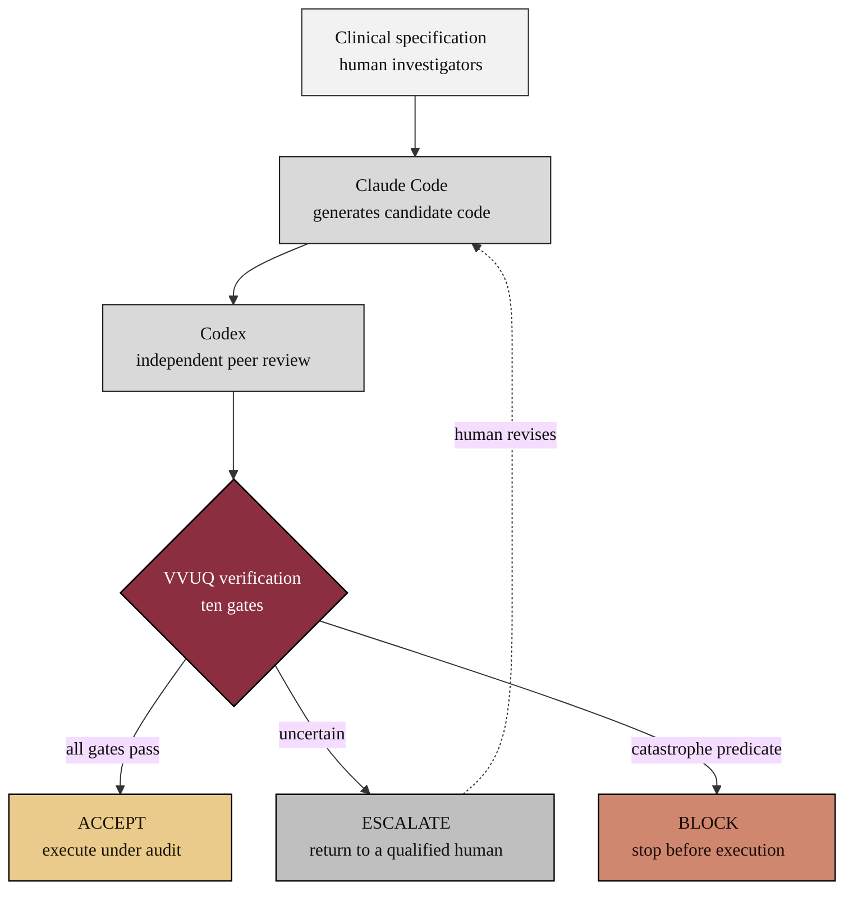

# law-physical-ai-trials

A narrative review that supports the H. R. 9510 (2026) transition to Federal law.

[](https://creativecommons.org/licenses/by/4.0/)
[](releases.md)
[](CHANGELOG.md)
[](.github/workflows/ci.yml)
[](https://www.python.org/)
[](https://doi.org/10.5281/zenodo.20619762)
[](https://doi.org/10.5281/zenodo.20619762)
[](https://doi.org/10.5281/zenodo.20685379)
[-8B2E3F.svg)](https://claude.com/claude-code)
[](review/)
[](review/sub-prompts/)
[](review/mermaid/)
[](review/final-narrative/sections/)
[](review/final-narrative/)
[](review/final-narrative/)
[](review/mermaid/)
[](review/template/)
[](review/)
[](review/)
[](review/final-narrative/)
[](review/references/)
[](releases.md)
[](https://orcid.org/0009-0007-5457-8667)

## What is new in v0.1.0

This v0.1.0 release adds a complete narrative review under `review/` that argues,
through eight emotional pillars, for enacting Physical AI Trial Bill H. R. 9510
v5.0 into Federal law. Built by one Claude Code agent across four stages (21
colored Mermaid figures, then draft, full, and final narratives), it pairs every
appeal with cited evidence, preserves the template theme, and compiles in Overleaf
with no raster images.

The review is written for legislators in medical AI who have neither robotics nor
Claude Code and Codex experience. It gains technical substance as it proceeds,
defining each term where needed, and it makes its case through the eight appeals
that legislative-advocacy research finds most persuasive, each paired with a
credible, cited fact.

## Table of contents

- [What is new in v0.1.0](#what-is-new-in-v010)
- [The eight body sections](#the-eight-body-sections)
- [Repository structure](#repository-structure)
- [The core mechanism (colored Mermaid)](#the-core-mechanism-colored-mermaid)
- [The eight pillars and the provisions that answer them](#the-eight-pillars-and-the-provisions-that-answer-them)
- [How the build works](#how-the-build-works)
- [Sources used from other repositories](#sources-used-from-other-repositories)
- [Visual media and palette](#visual-media-and-palette)
- [Documentation](#documentation)
- [License](#license)

## The eight body sections

| # | Section | Emotional pillar | Guiding appeal |
|:--|:--|:--|:--|
| 1 | Compassion and empathy | care for the patient | "What happens if we do nothing?" |
| 2 | Fear of preventable harm | avoidance of loss | "Without this law, more people will suffer." |
| 3 | Moral outrage | fairness | "This should not happen in America." |
| 4 | Hope | opportunity | "We can save lives if we act." |
| 5 | Responsibility and duty | obligation | "You have the power to prevent this." |
| 6 | Protection of vulnerable people | protection | bias, consent, and subgroup safety |
| 7 | Trust and reassurance | confidence | "This technology can be trusted." |
| 8 | Urgency | timeliness | "Patients are waiting now." |

## Repository structure

```
law-physical-ai-trials/
  README.md                  (this file)
  CHANGELOG.md               (v0.1.0)
  releases.md                (v0.1.0 release notes)
  LICENSE
  .github/workflows/ci.yml   (lint-and-format, green)
  review/
    README.md
    prompts/                 the submitted prompt + the run output
    sub-prompts/             Process A: four generated sub-prompts
    references/              author_works.bib + narrative_refs.bib
    template/                the reused paper template (unchanged theme)
    mermaid/                 Stage 1: 21 colored Mermaid figures + catalog
    draft-narrative/         Stage 2: scaffold with bracketed source cues
    full-narrative/          Stage 3: rendered manuscript (20 TikZ figs, 8 tables)
    final-narrative/         Stage 4: publication-quality manuscript (9 tables)
```

## The core mechanism (colored Mermaid)

Verification before generation, the principle at the center of H. R. 9510: a human
specification is drafted by one agent, reviewed by a second, and admitted only
after ten gates resolve to ACCEPT, ESCALATE, or BLOCK.



The argument accumulates across the eight pillars and converges on a single
legislative request.

```mermaid
%%{init: {'theme':'base','themeVariables':{'fontFamily':'Helvetica, Arial, sans-serif','lineColor':'#333333','primaryTextColor':'#111111'},'flowchart':{'curve':'natural','nodeSpacing':26,'rankSpacing':40,'htmlLabels':true}}}%%
flowchart LR
  P1["1 Compassion"]:::n1
  P2["2 Fear of harm"]:::risk
  P3["3 Moral outrage"]:::risk
  P4["4 Hope"]:::hope
  P5["5 Responsibility"]:::n2
  P6["6 Protection"]:::n2
  P7["7 Trust"]:::hope
  P8["8 Urgency"]:::risk
  ACT["Enact<br/>H. R. 9510"]:::act
  P1 --> P2 --> P3 --> P4 --> P5 --> P6 --> P7 --> P8 --> ACT
  classDef act fill:#8B2E3F,stroke:#000000,stroke-width:1.4px,color:#ffffff
  classDef hope fill:#EBCB8B,stroke:#000000,stroke-width:1.2px,color:#1A1505
  classDef risk fill:#D08770,stroke:#000000,stroke-width:1.2px,color:#1A0A04
  classDef n1 fill:#F2F2F2,stroke:#333333,stroke-width:1.1px,color:#111111
  classDef n2 fill:#D9D9D9,stroke:#222222,stroke-width:1.1px,color:#111111
```



## The eight pillars and the provisions that answer them

This synthesis table is reproduced from the final-narrative manuscript.

| Pillar | Provision of H. R. 9510 that answers it |
|:--|:--|
| Compassion | A verified pathway a patient can enter, with consent confirmed and recorded |
| Fear of harm | The mandatory ten-gate verification before any action executes |
| Moral outrage | Subgroup bias surveillance, measured and publicly reported |
| Hope | The authorization that funds a tested national trial platform |
| Responsibility | The conforming amendments that make verification the standard of care |
| Protection | Verified informed consent and a per-subgroup outcome audit |
| Trust | Each gate bound to a published standard, with a hash-chained audit trail |
| Urgency | A defined effective date and a budget-scored, bounded cost of acting |

## How the build works

A single submitted prompt (`review/prompts/prompt-narrative.md`) drives two
processes: Process A generated the four sub-prompts in `review/sub-prompts/`, and
Process B ran them in sequence to grow the manuscript through four stages.

```mermaid
%%{init: {'theme':'base','themeVariables':{'fontFamily':'Helvetica, Arial, sans-serif','lineColor':'#333333','primaryTextColor':'#111111'},'flowchart':{'curve':'basis','nodeSpacing':30,'rankSpacing':44,'htmlLabels':true}}}%%
flowchart LR
  MP["Master prompt"]:::n1
  SP["Process A<br/>4 sub-prompts"]:::n2
  M1["Stage 1<br/>21 Mermaid figures"]:::n2
  M2["Stage 2<br/>draft-narrative"]:::n3
  M3["Stage 3<br/>full-narrative"]:::act
  M4["Stage 4<br/>final-narrative"]:::act
  REL["v0.1.0 release"]:::hope
  MP --> SP --> M1 --> M2 --> M3 --> M4 --> REL
  classDef act fill:#8B2E3F,stroke:#000000,stroke-width:1.4px,color:#ffffff
  classDef hope fill:#EBCB8B,stroke:#000000,stroke-width:1.2px,color:#1A1505
  classDef n1 fill:#F2F2F2,stroke:#333333,stroke-width:1.1px,color:#111111
  classDef n2 fill:#D9D9D9,stroke:#222222,stroke-width:1.1px,color:#111111
  classDef n3 fill:#BFBFBF,stroke:#000000,stroke-width:1.2px,color:#111111
```



```
            Master prompt
                 |
        Process A | generate sub-prompts
                 v
   sub-prompts -> mermaid -> draft -> full -> final -> v0.1.0 release
   (4 prompts)   (21 figs)  (scaffold) (prose) (polish)
```

## Sources used from other repositories

| Asset used | Upstream source | Used in |
|:--|:--|:--|
| Paper template (theme, columns, ORCID mark) | `review/template` | every narrative stage |
| Colored Mermaid families and palette discipline | `Clinical-AI-Demos/.../ai-outputs/output-01` | `review/mermaid/` |
| Table of contents and back matter | `cancer-automated/.../papers/VVUQ-02/final-paper` | `draft-narrative` onward |
| Verification evidence (ten gates, 172 tests) | `cancer-automated/.../papers/VVUQ-02` | fear and trust sections |
| Sub-prompt and auto-commit methodology | `single-prompt-bill/.../auto-bill-02` | `sub-prompts/`; build schedule |
| Release and badge conventions | `kevinkawchak/cancer-automated` | this README, `CHANGELOG.md`, `releases.md` |

## Visual media and palette

No raster images are used. The permitted media are full-width white-background
tables, monospace ASCII figures, and colored Mermaid diagrams (native in Markdown,
reproduced as colored TikZ in the compiled LaTeX). The strict palette is black,
grayscales, and `#EBCB8B` (gold, hope), `#D08770` (clay, risk), and `#8B2E3F`
(burgundy, the Act). The `#8B2E3F` paper template theme is preserved.

## Documentation

- [`CHANGELOG.md`](CHANGELOG.md) - the v0.1.0 changelog.
- [`releases.md`](releases.md) - the v0.1.0 release notes.
- [`review/README.md`](review/README.md) - the review landing page.
- [`review/prompts/`](review/prompts/) - the submitted prompt and the run output.

## License

Released under CC BY 4.0; reproduced public-domain U.S. Government text is used
under 17 U.S.C. § 105. Author: Kevin Kawchak, CEO ChemicalQDevice
([ORCID 0009-0007-5457-8667](https://orcid.org/0009-0007-5457-8667)). DOI left as
[`10.5281/zenodo.xxxxxxxx`](https://doi.org/10.5281/zenodo.xxxxxxxx) pending
deposit.

*Independent research draft. Not enacted law, not pending legislation, and not
legal advice; not endorsed by the FDA, HHS, or any Member of Congress. The
illustrative number "H. R. 9510" is a placeholder. All figures are illustrative or
simulation results unless tied to a cited source.*
