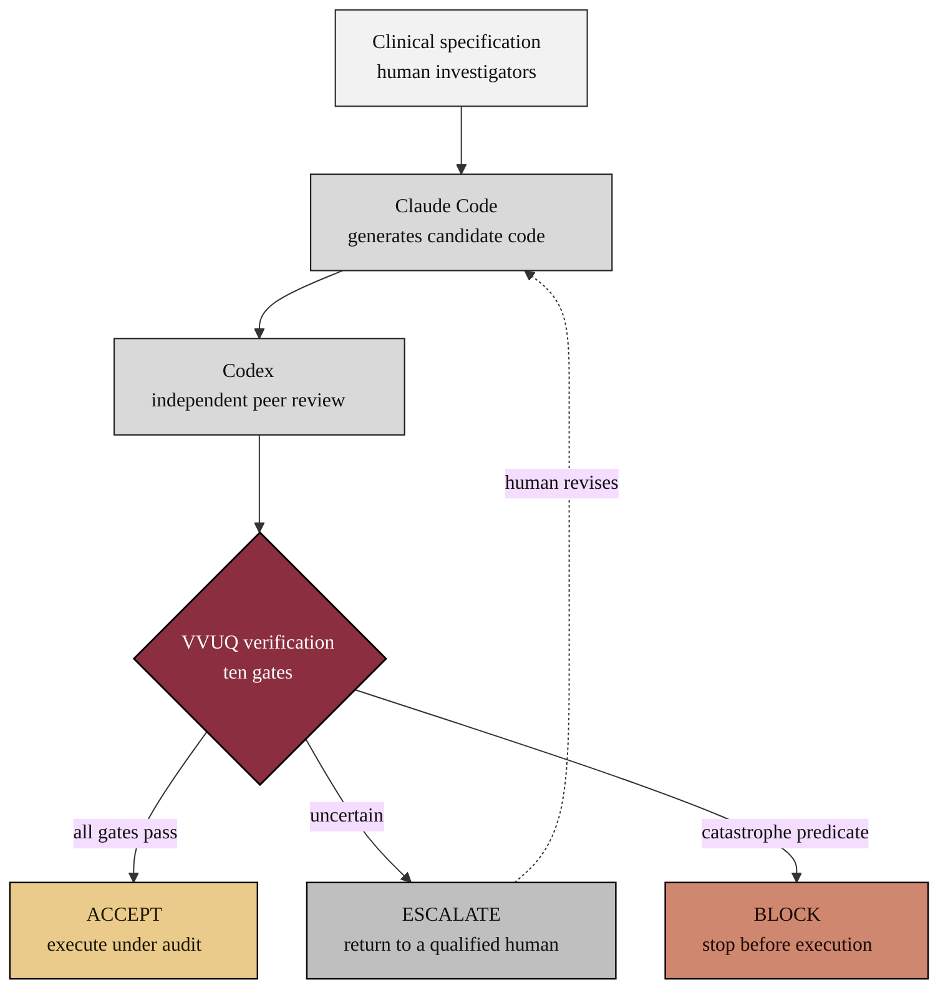

### 01. Verification Before Generation Workflow

The core idea of H. R. 9510 in one figure: human investigators write the
specification, Claude Code generates candidate code, Codex performs independent
peer review, and a ten-gate VVUQ check decides ACCEPT, ESCALATE, or BLOCK before
anything executes on a patient. A flowchart is correct here because the content is
a directed control flow with a decision node. Reproduced in the compiled LaTeX
narrative as a matching colored TikZ figure (palette: black, grayscales, #EBCB8B,
#D08770, #8B2E3F).

