### 02. The Eight Emotional Pillars

The reader's path through the narrative, from the most common appeal (compassion)
to the closing appeal (urgency), each pillar leading to the single action of
enacting H. R. 9510. A left-to-right flowchart is correct because it shows an
ordered argument that accumulates toward one decision. Reproduced in the compiled
LaTeX narrative as a matching colored TikZ figure (palette: black, grayscales,
#EBCB8B, #D08770, #8B2E3F).

```mermaid
%%{init: {'theme':'base','themeVariables':{'fontFamily':'Helvetica, Arial, sans-serif','lineColor':'#333333','primaryTextColor':'#111111'},'flowchart':{'curve':'natural','nodeSpacing':26,'rankSpacing':40,'htmlLabels':true}}}%%
flowchart LR
  P1["1 Compassion"]:::n1
  P2["2 Fear of harm"]:::risk
  P3["3 Moral outrage"]:::risk
  P4["4 Hope"]:::hope
  P5["5 Responsibility"]:::n2
  P6["6 Protection"]:::n2
  P7["7 Trust"]:::hope
  P8["8 Urgency"]:::risk
  ACT["Enact<br/>H. R. 9510"]:::act
  P1 --> P2 --> P3 --> P4 --> P5 --> P6 --> P7 --> P8 --> ACT
  classDef act fill:#8B2E3F,stroke:#000000,stroke-width:1.4px,color:#ffffff
  classDef hope fill:#EBCB8B,stroke:#000000,stroke-width:1.2px,color:#1A1505
  classDef risk fill:#D08770,stroke:#000000,stroke-width:1.2px,color:#1A0A04
  classDef n1 fill:#F2F2F2,stroke:#333333,stroke-width:1.1px,color:#111111
  classDef n2 fill:#D9D9D9,stroke:#222222,stroke-width:1.1px,color:#111111
```

