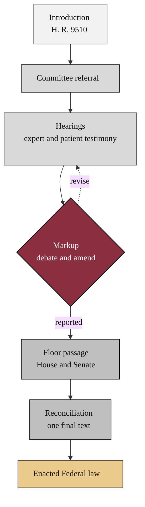

### 03. The Bill-to-Law Process

How H. R. 9510 becomes law: introduction, committee referral and markup, hearings
with expert and patient testimony, floor passage in each chamber, reconciliation
of any differences, and enactment. A top-down flowchart is correct because the
legislative path is a staged process with a feedback loop at markup. Reproduced in
the compiled LaTeX narrative as a matching colored TikZ figure (palette: black,
grayscales, #EBCB8B, #D08770, #8B2E3F).

