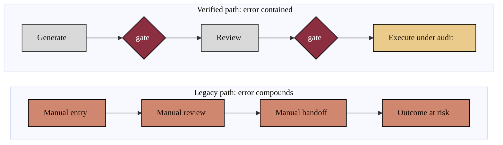

### 04. Compounding Human Error Versus the Verified Path

The legacy trial and peer-review system passes work through many manual handoffs,
and each handoff is an independent opportunity for error that compounds downstream.
The verified path inserts an automated gate at each step so a defect is caught
where it occurs. Two parallel flows make the contrast legible. Reproduced in the
compiled LaTeX narrative as a matching colored TikZ figure (palette: black,
grayscales, #EBCB8B, #D08770, #8B2E3F).

