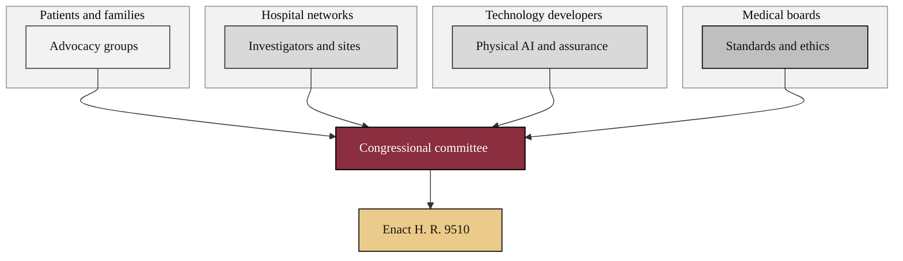

### 05. The Coalition Map

Coalition building shows lawmakers that the bill has wide-ranging support.
Patient-advocacy groups, hospital networks, technology developers, and medical
boards each bring distinct evidence to the same committee. A clustered flowchart
with one subgraph per constituency is correct because it groups independent actors
that converge on a single legislative target. Reproduced in the compiled LaTeX
narrative as a matching colored TikZ figure (palette: black, grayscales, #EBCB8B,
#D08770, #8B2E3F).

