### 06. Evidence-to-Law Lineage

H. R. 9510 did not arrive from nowhere. It rests on a documented lineage of prior
work, from early conversational-AI cancer studies, through the National Physical
AI Oncology Trial Platform and the verification pipeline, to the five successive
bill versions. A left-to-right flowchart is correct because it traces a single
evidentiary thread over time. Reproduced in the compiled LaTeX narrative as a
matching colored TikZ figure (palette: black, grayscales, #EBCB8B, #D08770,
#8B2E3F).

```mermaid
%%{init: {'theme':'base','themeVariables':{'fontFamily':'Helvetica, Arial, sans-serif','lineColor':'#333333','primaryTextColor':'#111111'},'flowchart':{'curve':'basis','nodeSpacing':28,'rankSpacing':44,'htmlLabels':true}}}%%
flowchart LR
  E1["Conversational AI<br/>cancer studies"]:::n1
  E2["VVUQ pipeline<br/>51-test method"]:::n2
  E3["Surgical humanoid<br/>172 tests, 10 gates"]:::n2
  E4["National platform<br/>and CFR adaptions"]:::n3
  E5["Bill v1.0 to v4.0"]:::n3
  E6["H. R. 9510 v5.0"]:::act
  LAW["Federal AI law"]:::hope
  E1 --> E2 --> E3 --> E4 --> E5 --> E6 --> LAW
  classDef act fill:#8B2E3F,stroke:#000000,stroke-width:1.4px,color:#ffffff
  classDef hope fill:#EBCB8B,stroke:#000000,stroke-width:1.2px,color:#1A1505
  classDef n1 fill:#F2F2F2,stroke:#333333,stroke-width:1.1px,color:#111111
  classDef n2 fill:#D9D9D9,stroke:#222222,stroke-width:1.1px,color:#111111
  classDef n3 fill:#BFBFBF,stroke:#000000,stroke-width:1.2px,color:#111111
```

