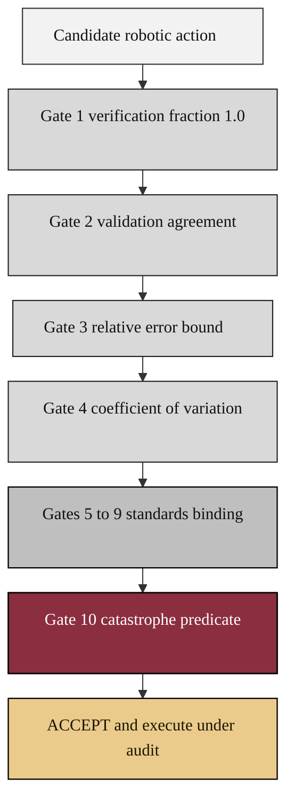

### 07. The Ten VVUQ Gates

Every candidate robotic action descends through ten verification, validation, and
uncertainty-quantification gates before it may execute, ending with a catastrophe
predicate that can hard-block. A vertical flowchart funnel is correct because the
content is a strict sequence of pass conditions that narrows to a single accept.
Reproduced in the compiled LaTeX narrative as a matching colored TikZ figure
(palette: black, grayscales, #EBCB8B, #D08770, #8B2E3F).

