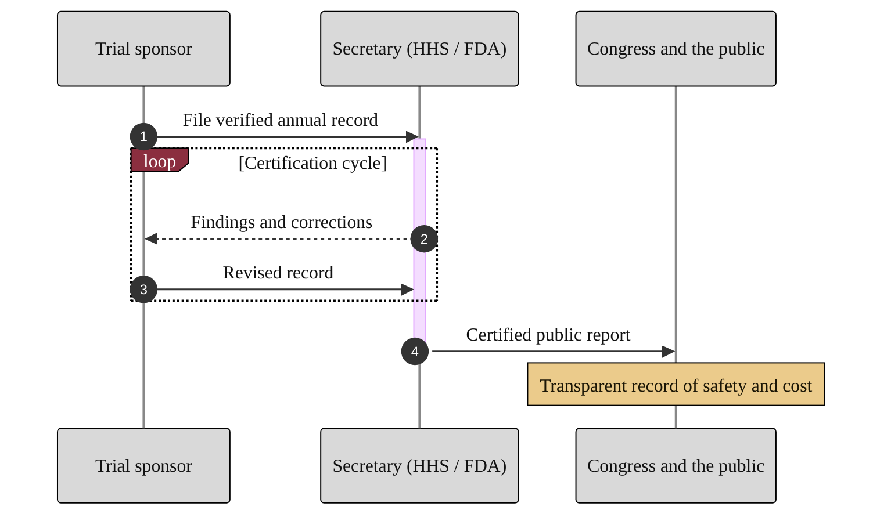

### 08. The Annual Reporting Sequence

Accountability under the Act flows on a fixed schedule: the trial sponsor files a
verified record, the Secretary reviews and certifies it, and a public report
reaches Congress. A sequence diagram is correct because the content is an ordered
exchange of messages between named parties over time, with a review loop.
Reproduced in the compiled LaTeX narrative as a matching colored TikZ figure
(palette: black, grayscales, #EBCB8B, #D08770, #8B2E3F).

