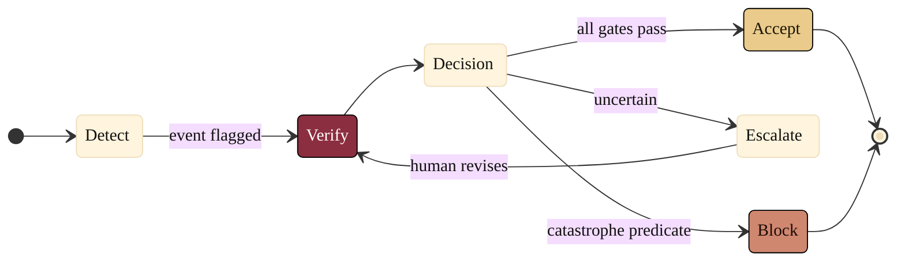

### 09. The Verification Decision State Machine

At runtime the system is always in one of a few states: it detects an event,
verifies against the gates, and resolves to ACCEPT, ESCALATE to a qualified human,
or BLOCK before execution. A state diagram is correct because the content is a set
of discrete states with guarded transitions and a choice. Reproduced in the
compiled LaTeX narrative as a matching colored TikZ figure (palette: black,
grayscales, #EBCB8B, #D08770, #8B2E3F).

