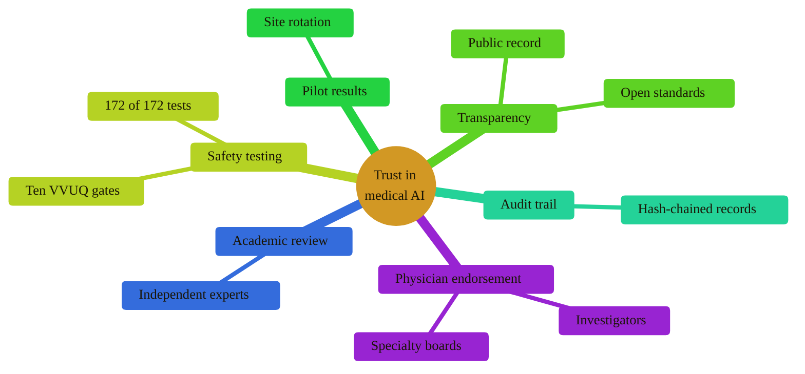

### 10. Trust Scaffolding

Public trust in medical AI is not asserted; it is built from named supports:
physician endorsement, academic review, safety-testing requirements, transparency
provisions, pilot results, and an immutable audit trail. A mindmap is correct
because the content is one central concept with parallel, non-sequential
supports. Reproduced in the compiled LaTeX narrative as a matching colored TikZ
figure (palette: black, grayscales, #EBCB8B, #D08770, #8B2E3F).

