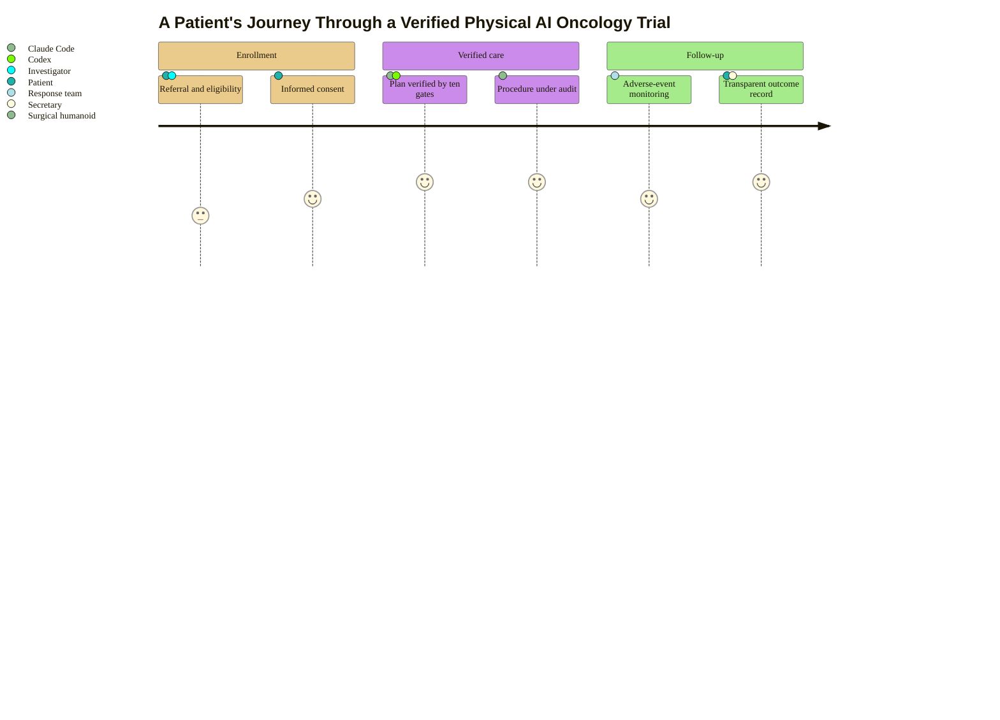

### 11. The Patient Journey Through a Regulated Trial

A patient's experience scored step by step, from referral and consent through a
verified procedure to follow-up, showing where confidence is highest and where
friction remains. A user journey is correct because the content is an ordered
lived experience with a satisfaction score per step. Reproduced in the compiled
LaTeX narrative as a matching colored TikZ figure (palette: black, grayscales,
#EBCB8B, #D08770, #8B2E3F).

