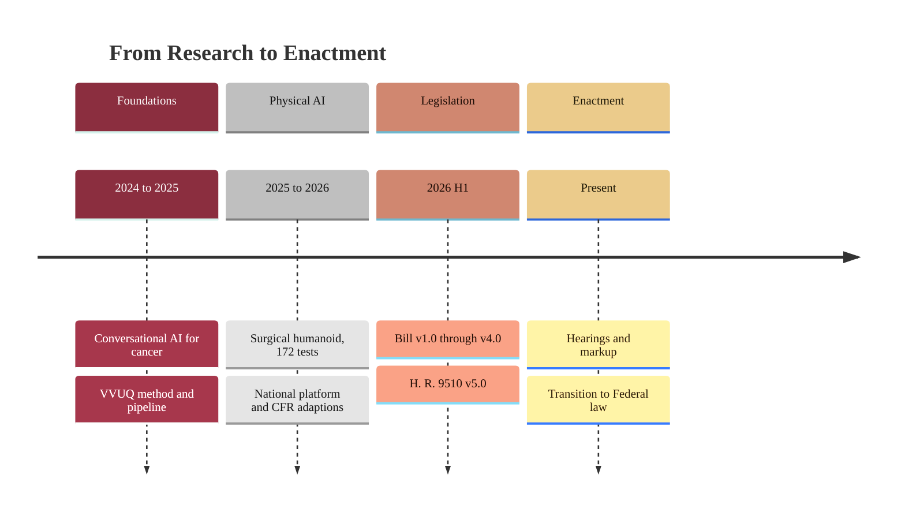

### 12. The Evidence-and-Legislation Timeline

The work that supports H. R. 9510 unfolded over a clear sequence of phases:
foundational AI research, the verification pipeline, the bill versions, and the
present push to enactment. A timeline is correct because the content is ordered by
date and grouped into phases. Reproduced in the compiled LaTeX narrative as a
matching colored TikZ figure (palette: black, grayscales, #EBCB8B, #D08770,
#8B2E3F).

