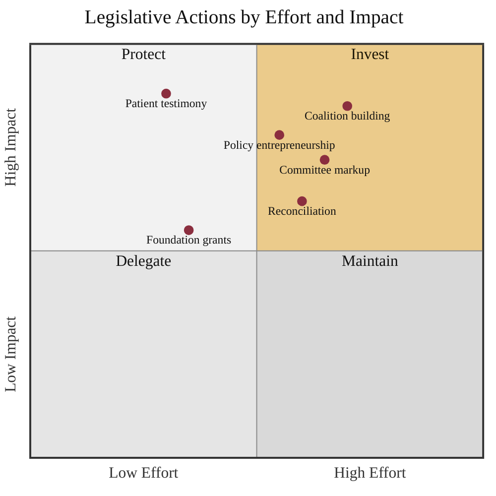

### 13. Legislative Actions by Effort and Impact

The MAIN ACTIONS plotted by the effort they require against the impact they have
on passage, so a coalition can decide where to invest. A quadrant chart is correct
because the content is a set of options compared on two continuous axes.
Reproduced in the compiled LaTeX narrative as a matching colored TikZ figure
(palette: black, grayscales, #EBCB8B, #D08770, #8B2E3F).

