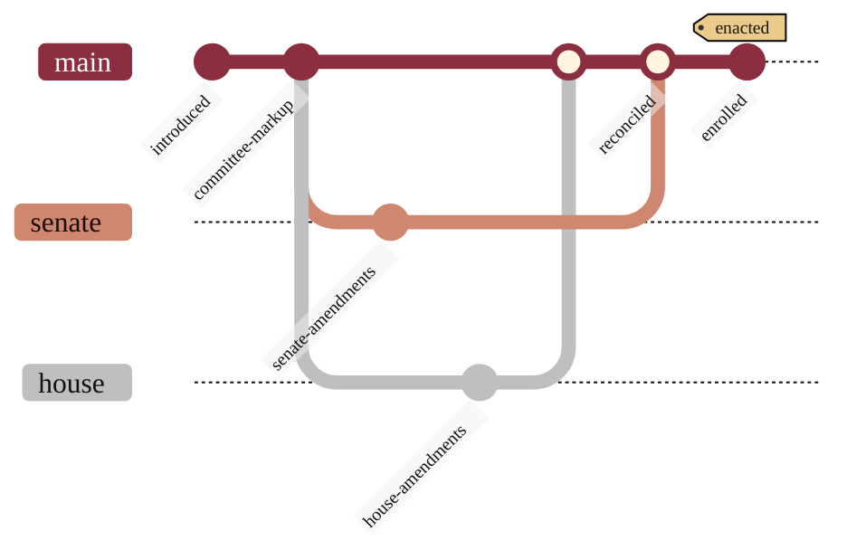

### 14. Reconciliation of Two Chambers

When the House and the Senate pass different versions of the bill, a conference
reconciles them into one final text that both chambers vote on. A version-control
graph is the most literal rendering of two branches merging back into a single
line. Reproduced in the compiled LaTeX narrative as a matching colored TikZ figure
(palette: black, grayscales, #EBCB8B, #D08770, #8B2E3F).

