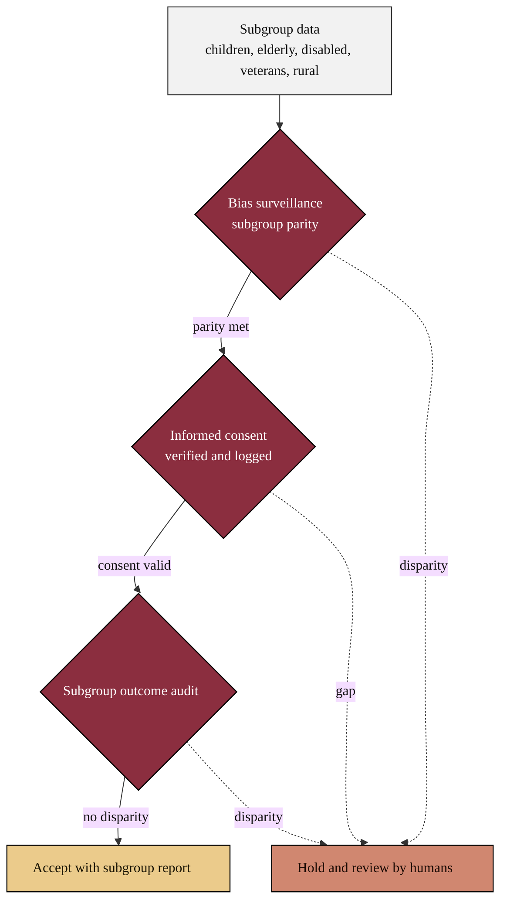

### 15. Safeguards for Vulnerable Populations

Protection is built in, not bolted on: every enrolled subgroup passes a bias
surveillance check, an informed-consent gate, and a subgroup-outcome audit before
results are accepted. A flowchart with explicit gates is correct because the
content is a set of mandatory checks guarding a single accept. Reproduced in the
compiled LaTeX narrative as a matching colored TikZ figure (palette: black,
grayscales, #EBCB8B, #D08770, #8B2E3F).

