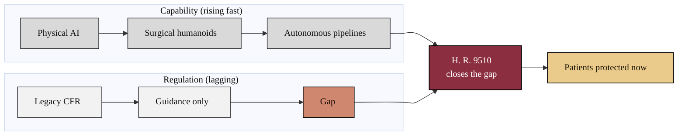

### 16. The Widening Capability-Regulation Gap

Technology capability is advancing faster than the rules that govern it, and the
distance between the two is where preventable harm accumulates. The Act is the
bridge that closes the gap. A two-track flowchart is correct because it contrasts
two trajectories over time and the single instrument that joins them. Reproduced
in the compiled LaTeX narrative as a matching colored TikZ figure (palette: black,
grayscales, #EBCB8B, #D08770, #8B2E3F).

