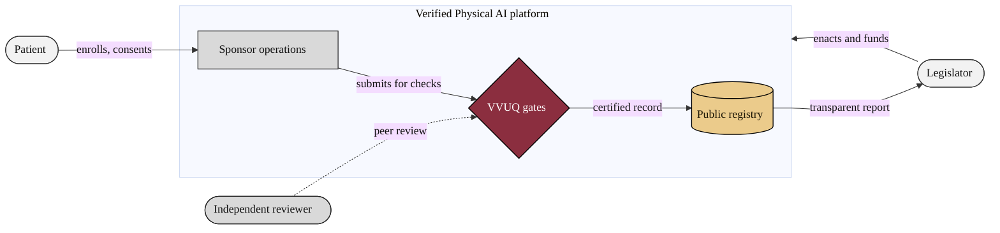

### 17. System Context

The whole arrangement seen from a distance: the people (patient, legislator,
sponsor, independent reviewer) and the systems (the verified platform and the
public registry) and how they relate. Distinct node shapes carry the system
context lens without leaving the strict palette. Reproduced in the compiled LaTeX
narrative as a matching colored TikZ figure (palette: black, grayscales, #EBCB8B,
#D08770, #8B2E3F).

