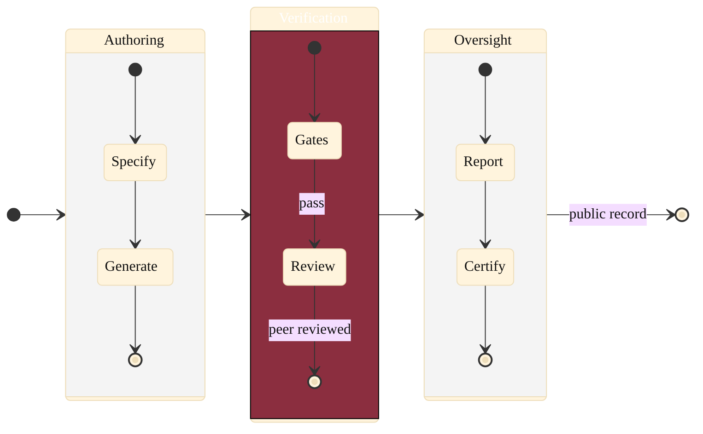

### 18. Composite Oversight State Machine

The same workflow nested into three super-states, Authoring, Verification, and
Oversight, to show that the model scales to institutional complexity without
clutter. A composite state diagram is correct because the content is nested states
with internal transitions and a clean exit. Reproduced in the compiled LaTeX
narrative as a matching colored TikZ figure (palette: black, grayscales, #EBCB8B,
#D08770, #8B2E3F).

