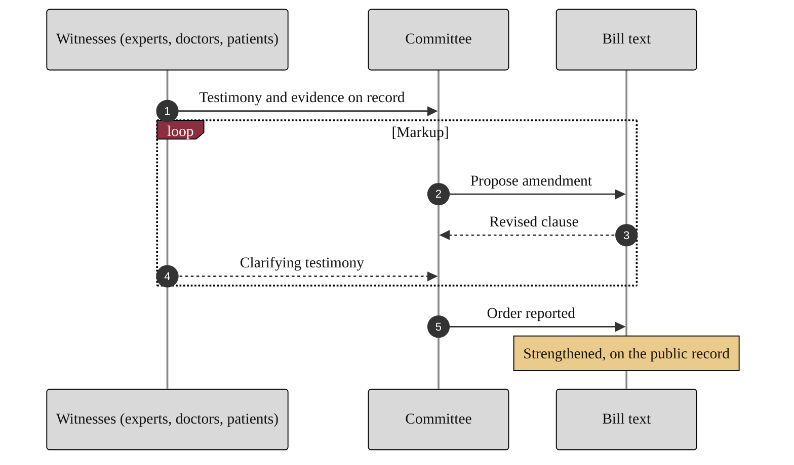

### 19. Markup and Testimony

The committee markup is where the bill is debated, amended, and rewritten on the
strength of testimony from AI experts, physicians, and patients, building the
official public record. A sequence diagram is correct because the content is a
structured exchange between the committee and its witnesses with an amendment
loop. Reproduced in the compiled LaTeX narrative as a matching colored TikZ figure
(palette: black, grayscales, #EBCB8B, #D08770, #8B2E3F).

