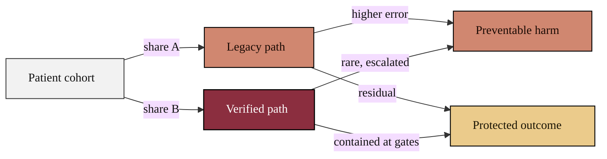

### 20. Patient Throughput: Legacy Versus Verified

How a cohort of patients flows to outcomes under the legacy path and under the
verified path, with the edge labels carrying the volume at each split. A weighted
flowchart is correct because it shows how work divides and converges while keeping
every color under the strict palette. Reproduced in the compiled LaTeX narrative
as a matching colored TikZ figure (palette: black, grayscales, #EBCB8B, #D08770,
#8B2E3F).

