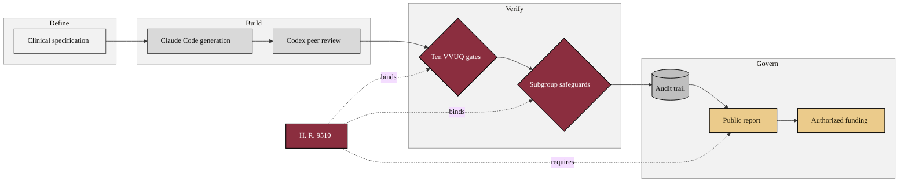

### 21. The National Platform Capstone

The capstone shows how the six-step verification baseline extends to a national
Physical AI oncology trial platform, grouped into four phases, define, build,
verify, and govern, with the Act binding the whole. A phase-grouped flowchart is
correct because it scales the model to many connected components while keeping the
flow fluent. Reproduced in the compiled LaTeX narrative as a matching colored TikZ
figure (palette: black, grayscales, #EBCB8B, #D08770, #8B2E3F).

