## output-mermaid

# Colored Mermaid Catalog for the H. R. 9510 Narrative Review

Twenty-one professional, colored Mermaid figures that illustrate the eight
emotional-pillar sections and the legislative argument of the narrative review.
They are produced by sub-prompt 1 (`../sub-prompts/prompt-1-mermaid.md`) and are
adapted from the curated Mermaid families in
`Clinical-AI-Demos/tree/main/ai-outputs/output-01`, re-themed to this project.

Every figure uses the strict palette only: black, grayscales, and the three theme
colors `#EBCB8B` (gold, hope), `#D08770` (clay, risk), and `#8B2E3F` (burgundy,
the Act). The `#8B2E3F` paper template theme is preserved. Each figure is
reproduced in the compiled LaTeX narrative as a matching colored TikZ figure in
the same palette, and the figures are refined across the draft, full, and final
stages.

### Palette

| Role | Fill | Text | Meaning |
|:--|:--|:--|:--|
| `act` | `#8B2E3F` | white | the Act, verification, human protection |
| `hope` | `#EBCB8B` | black | hope, benefit, accepted outcome |
| `risk` | `#D08770` | black | harm, risk, the legacy path |
| `n1` | `#F2F2F2` | black | inputs, light structure |
| `n2` | `#D9D9D9` | black | process steps |
| `n3` | `#BFBFBF` | black | gates, emphasis structure |

### Index

1. Verification Before Generation Workflow
2. The Eight Emotional Pillars
3. The Bill-to-Law Process
4. Compounding Human Error Versus the Verified Path
5. The Coalition Map
6. Evidence-to-Law Lineage
7. The Ten VVUQ Gates
8. The Annual Reporting Sequence
9. The Verification Decision State Machine
10. Trust Scaffolding
11. The Patient Journey Through a Regulated Trial
12. The Evidence-and-Legislation Timeline
13. Legislative Actions by Effort and Impact
14. Reconciliation of Two Chambers
15. Safeguards for Vulnerable Populations
16. The Widening Capability-Regulation Gap
17. System Context
18. Composite Oversight State Machine
19. Markup and Testimony
20. Patient Throughput: Legacy Versus Verified
21. The National Platform Capstone

---

### 01. Verification Before Generation Workflow

The core idea of H. R. 9510 in one figure: human investigators write the
specification, Claude Code generates candidate code, Codex performs independent
peer review, and a ten-gate VVUQ check decides ACCEPT, ESCALATE, or BLOCK before
anything executes on a patient. A flowchart is correct here because the content is
a directed control flow with a decision node. Reproduced in the compiled LaTeX
narrative as a matching colored TikZ figure (palette: black, grayscales, #EBCB8B,
#D08770, #8B2E3F).

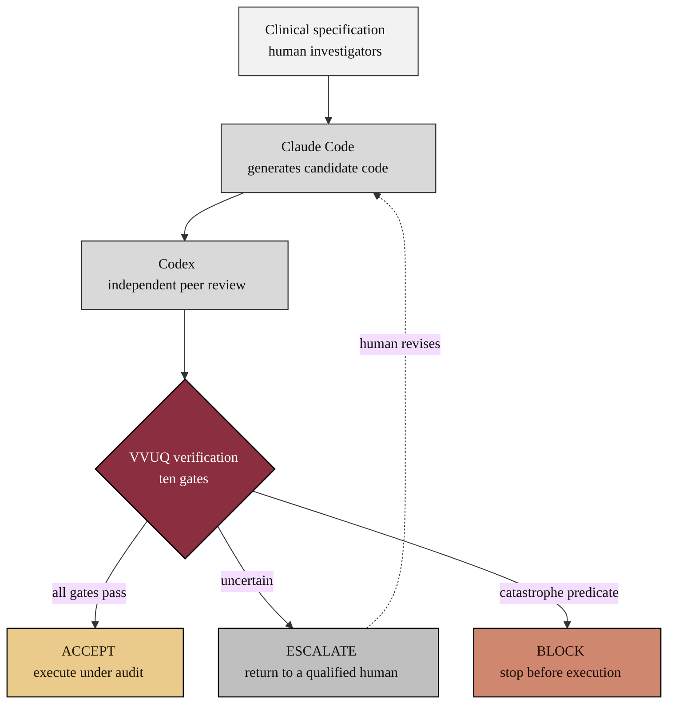
### 02. The Eight Emotional Pillars

The reader's path through the narrative, from the most common appeal (compassion)
to the closing appeal (urgency), each pillar leading to the single action of
enacting H. R. 9510. A left-to-right flowchart is correct because it shows an
ordered argument that accumulates toward one decision. Reproduced in the compiled
LaTeX narrative as a matching colored TikZ figure (palette: black, grayscales,
#EBCB8B, #D08770, #8B2E3F).

```mermaid
%%{init: {'theme':'base','themeVariables':{'fontFamily':'Helvetica, Arial, sans-serif','lineColor':'#333333','primaryTextColor':'#111111'},'flowchart':{'curve':'natural','nodeSpacing':26,'rankSpacing':40,'htmlLabels':true}}}%%
flowchart LR
  P1["1 Compassion"]:::n1
  P2["2 Fear of harm"]:::risk
  P3["3 Moral outrage"]:::risk
  P4["4 Hope"]:::hope
  P5["5 Responsibility"]:::n2
  P6["6 Protection"]:::n2
  P7["7 Trust"]:::hope
  P8["8 Urgency"]:::risk
  ACT["Enact<br/>H. R. 9510"]:::act
  P1 --> P2 --> P3 --> P4 --> P5 --> P6 --> P7 --> P8 --> ACT
  classDef act fill:#8B2E3F,stroke:#000000,stroke-width:1.4px,color:#ffffff
  classDef hope fill:#EBCB8B,stroke:#000000,stroke-width:1.2px,color:#1A1505
  classDef risk fill:#D08770,stroke:#000000,stroke-width:1.2px,color:#1A0A04
  classDef n1 fill:#F2F2F2,stroke:#333333,stroke-width:1.1px,color:#111111
  classDef n2 fill:#D9D9D9,stroke:#222222,stroke-width:1.1px,color:#111111
```
### 03. The Bill-to-Law Process

How H. R. 9510 becomes law: introduction, committee referral and markup, hearings
with expert and patient testimony, floor passage in each chamber, reconciliation
of any differences, and enactment. A top-down flowchart is correct because the
legislative path is a staged process with a feedback loop at markup. Reproduced in
the compiled LaTeX narrative as a matching colored TikZ figure (palette: black,
grayscales, #EBCB8B, #D08770, #8B2E3F).

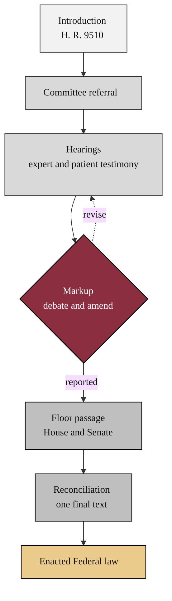
### 04. Compounding Human Error Versus the Verified Path

The legacy trial and peer-review system passes work through many manual handoffs,
and each handoff is an independent opportunity for error that compounds downstream.
The verified path inserts an automated gate at each step so a defect is caught
where it occurs. Two parallel flows make the contrast legible. Reproduced in the
compiled LaTeX narrative as a matching colored TikZ figure (palette: black,
grayscales, #EBCB8B, #D08770, #8B2E3F).

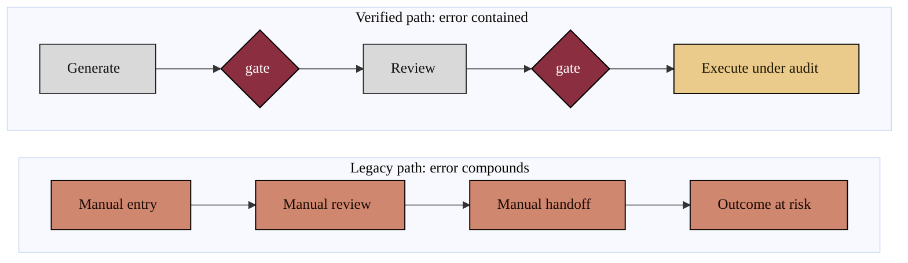
### 05. The Coalition Map

Coalition building shows lawmakers that the bill has wide-ranging support.
Patient-advocacy groups, hospital networks, technology developers, and medical
boards each bring distinct evidence to the same committee. A clustered flowchart
with one subgraph per constituency is correct because it groups independent actors
that converge on a single legislative target. Reproduced in the compiled LaTeX
narrative as a matching colored TikZ figure (palette: black, grayscales, #EBCB8B,
#D08770, #8B2E3F).

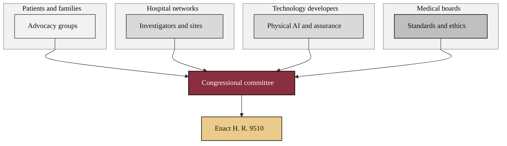
### 06. Evidence-to-Law Lineage

H. R. 9510 did not arrive from nowhere. It rests on a documented lineage of prior
work, from early conversational-AI cancer studies, through the National Physical
AI Oncology Trial Platform and the verification pipeline, to the five successive
bill versions. A left-to-right flowchart is correct because it traces a single
evidentiary thread over time. Reproduced in the compiled LaTeX narrative as a
matching colored TikZ figure (palette: black, grayscales, #EBCB8B, #D08770,
#8B2E3F).

```mermaid
%%{init: {'theme':'base','themeVariables':{'fontFamily':'Helvetica, Arial, sans-serif','lineColor':'#333333','primaryTextColor':'#111111'},'flowchart':{'curve':'basis','nodeSpacing':28,'rankSpacing':44,'htmlLabels':true}}}%%
flowchart LR
  E1["Conversational AI<br/>cancer studies"]:::n1
  E2["VVUQ pipeline<br/>51-test method"]:::n2
  E3["Surgical humanoid<br/>172 tests, 10 gates"]:::n2
  E4["National platform<br/>and CFR adaptions"]:::n3
  E5["Bill v1.0 to v4.0"]:::n3
  E6["H. R. 9510 v5.0"]:::act
  LAW["Federal AI law"]:::hope
  E1 --> E2 --> E3 --> E4 --> E5 --> E6 --> LAW
  classDef act fill:#8B2E3F,stroke:#000000,stroke-width:1.4px,color:#ffffff
  classDef hope fill:#EBCB8B,stroke:#000000,stroke-width:1.2px,color:#1A1505
  classDef n1 fill:#F2F2F2,stroke:#333333,stroke-width:1.1px,color:#111111
  classDef n2 fill:#D9D9D9,stroke:#222222,stroke-width:1.1px,color:#111111
  classDef n3 fill:#BFBFBF,stroke:#000000,stroke-width:1.2px,color:#111111
```
### 07. The Ten VVUQ Gates

Every candidate robotic action descends through ten verification, validation, and
uncertainty-quantification gates before it may execute, ending with a catastrophe
predicate that can hard-block. A vertical flowchart funnel is correct because the
content is a strict sequence of pass conditions that narrows to a single accept.
Reproduced in the compiled LaTeX narrative as a matching colored TikZ figure
(palette: black, grayscales, #EBCB8B, #D08770, #8B2E3F).

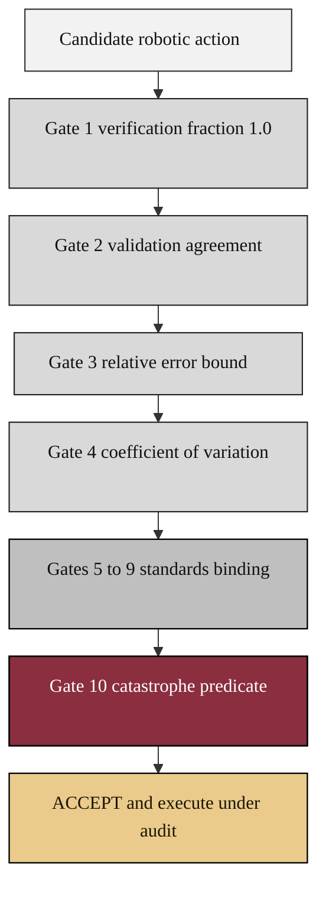
### 08. The Annual Reporting Sequence

Accountability under the Act flows on a fixed schedule: the trial sponsor files a
verified record, the Secretary reviews and certifies it, and a public report
reaches Congress. A sequence diagram is correct because the content is an ordered
exchange of messages between named parties over time, with a review loop.
Reproduced in the compiled LaTeX narrative as a matching colored TikZ figure
(palette: black, grayscales, #EBCB8B, #D08770, #8B2E3F).

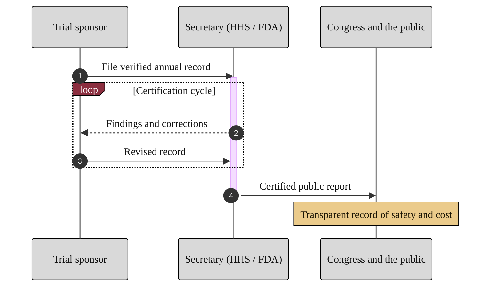
### 09. The Verification Decision State Machine

At runtime the system is always in one of a few states: it detects an event,
verifies against the gates, and resolves to ACCEPT, ESCALATE to a qualified human,
or BLOCK before execution. A state diagram is correct because the content is a set
of discrete states with guarded transitions and a choice. Reproduced in the
compiled LaTeX narrative as a matching colored TikZ figure (palette: black,
grayscales, #EBCB8B, #D08770, #8B2E3F).

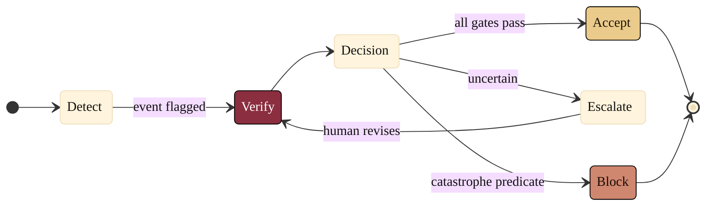
### 10. Trust Scaffolding

Public trust in medical AI is not asserted; it is built from named supports:
physician endorsement, academic review, safety-testing requirements, transparency
provisions, pilot results, and an immutable audit trail. A mindmap is correct
because the content is one central concept with parallel, non-sequential
supports. Reproduced in the compiled LaTeX narrative as a matching colored TikZ
figure (palette: black, grayscales, #EBCB8B, #D08770, #8B2E3F).

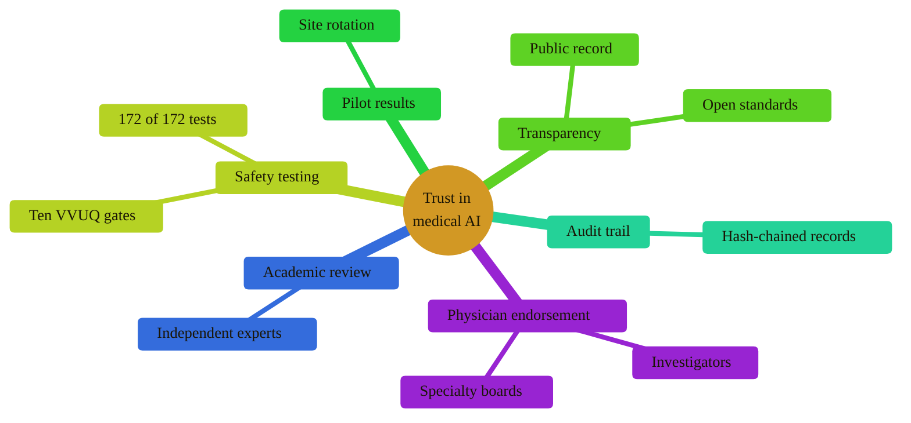
### 11. The Patient Journey Through a Regulated Trial

A patient's experience scored step by step, from referral and consent through a
verified procedure to follow-up, showing where confidence is highest and where
friction remains. A user journey is correct because the content is an ordered
lived experience with a satisfaction score per step. Reproduced in the compiled
LaTeX narrative as a matching colored TikZ figure (palette: black, grayscales,
#EBCB8B, #D08770, #8B2E3F).

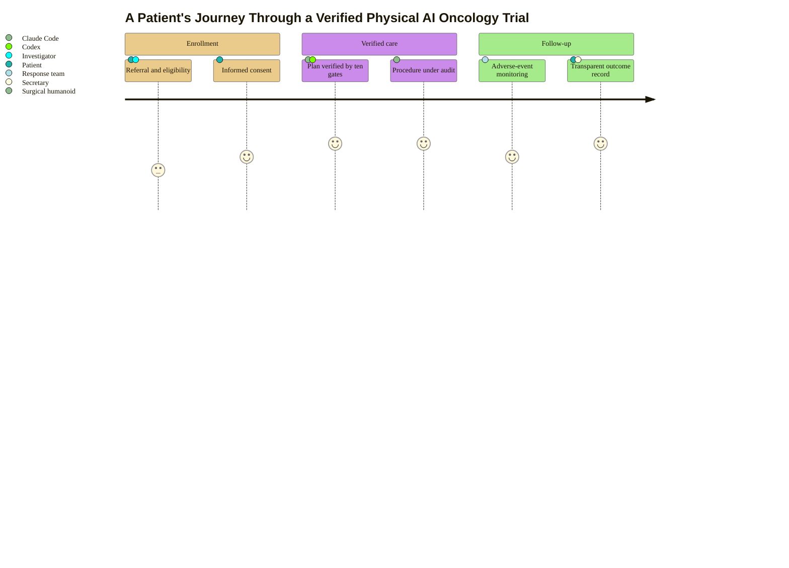
### 12. The Evidence-and-Legislation Timeline

The work that supports H. R. 9510 unfolded over a clear sequence of phases:
foundational AI research, the verification pipeline, the bill versions, and the
present push to enactment. A timeline is correct because the content is ordered by
date and grouped into phases. Reproduced in the compiled LaTeX narrative as a
matching colored TikZ figure (palette: black, grayscales, #EBCB8B, #D08770,
#8B2E3F).

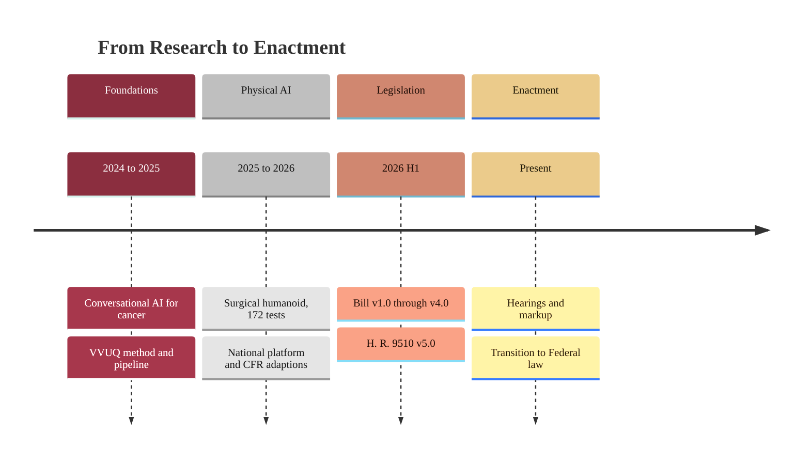
### 13. Legislative Actions by Effort and Impact

The MAIN ACTIONS plotted by the effort they require against the impact they have
on passage, so a coalition can decide where to invest. A quadrant chart is correct
because the content is a set of options compared on two continuous axes.
Reproduced in the compiled LaTeX narrative as a matching colored TikZ figure
(palette: black, grayscales, #EBCB8B, #D08770, #8B2E3F).

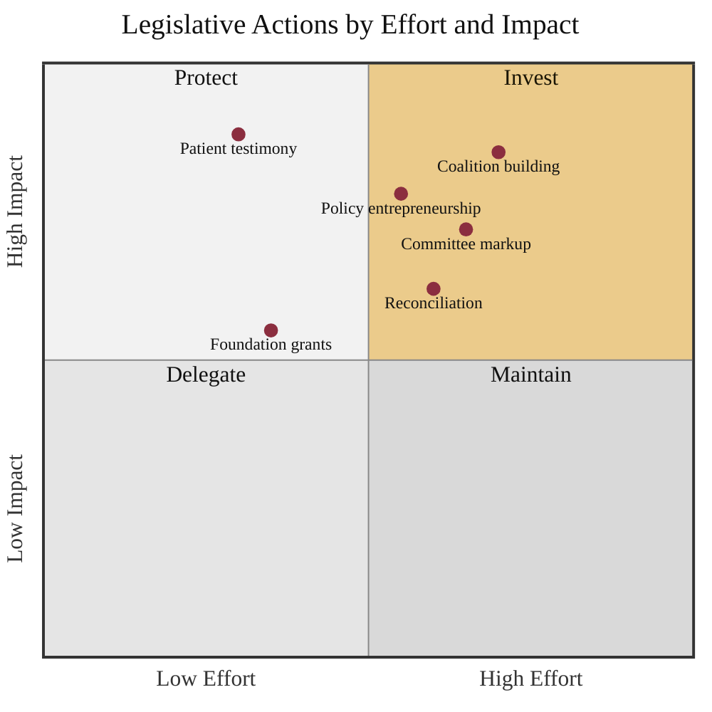
### 14. Reconciliation of Two Chambers

When the House and the Senate pass different versions of the bill, a conference
reconciles them into one final text that both chambers vote on. A version-control
graph is the most literal rendering of two branches merging back into a single
line. Reproduced in the compiled LaTeX narrative as a matching colored TikZ figure
(palette: black, grayscales, #EBCB8B, #D08770, #8B2E3F).

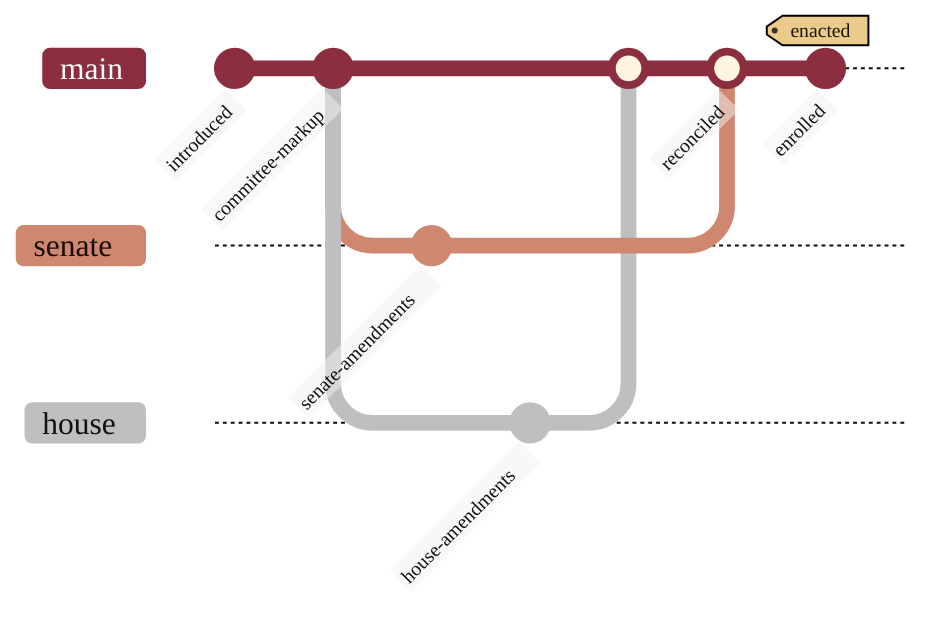
### 15. Safeguards for Vulnerable Populations

Protection is built in, not bolted on: every enrolled subgroup passes a bias
surveillance check, an informed-consent gate, and a subgroup-outcome audit before
results are accepted. A flowchart with explicit gates is correct because the
content is a set of mandatory checks guarding a single accept. Reproduced in the
compiled LaTeX narrative as a matching colored TikZ figure (palette: black,
grayscales, #EBCB8B, #D08770, #8B2E3F).

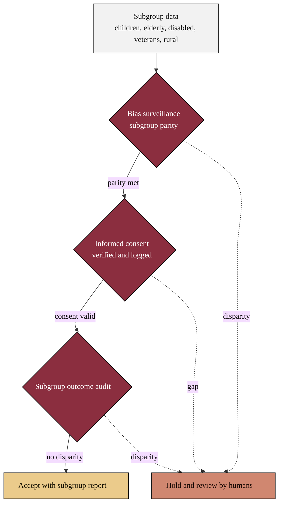
### 16. The Widening Capability-Regulation Gap

Technology capability is advancing faster than the rules that govern it, and the
distance between the two is where preventable harm accumulates. The Act is the
bridge that closes the gap. A two-track flowchart is correct because it contrasts
two trajectories over time and the single instrument that joins them. Reproduced
in the compiled LaTeX narrative as a matching colored TikZ figure (palette: black,
grayscales, #EBCB8B, #D08770, #8B2E3F).

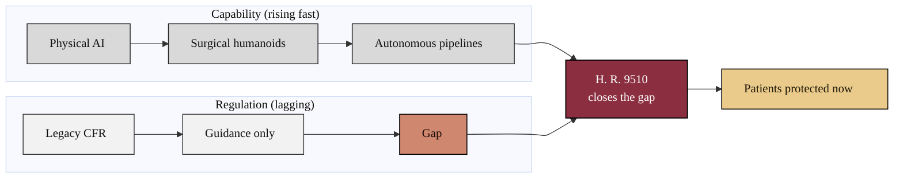
### 17. System Context

The whole arrangement seen from a distance: the people (patient, legislator,
sponsor, independent reviewer) and the systems (the verified platform and the
public registry) and how they relate. Distinct node shapes carry the system
context lens without leaving the strict palette. Reproduced in the compiled LaTeX
narrative as a matching colored TikZ figure (palette: black, grayscales, #EBCB8B,
#D08770, #8B2E3F).

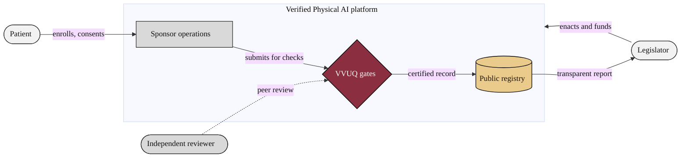
### 18. Composite Oversight State Machine

The same workflow nested into three super-states, Authoring, Verification, and
Oversight, to show that the model scales to institutional complexity without
clutter. A composite state diagram is correct because the content is nested states
with internal transitions and a clean exit. Reproduced in the compiled LaTeX
narrative as a matching colored TikZ figure (palette: black, grayscales, #EBCB8B,
#D08770, #8B2E3F).

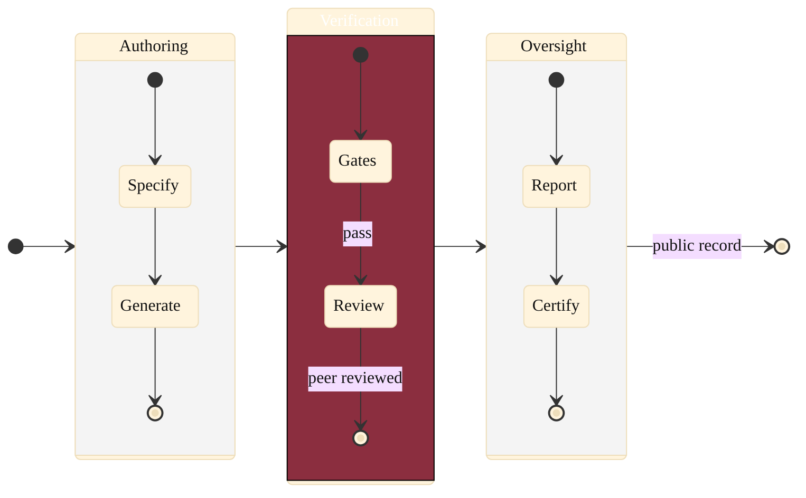
### 19. Markup and Testimony

The committee markup is where the bill is debated, amended, and rewritten on the
strength of testimony from AI experts, physicians, and patients, building the
official public record. A sequence diagram is correct because the content is a
structured exchange between the committee and its witnesses with an amendment
loop. Reproduced in the compiled LaTeX narrative as a matching colored TikZ figure
(palette: black, grayscales, #EBCB8B, #D08770, #8B2E3F).

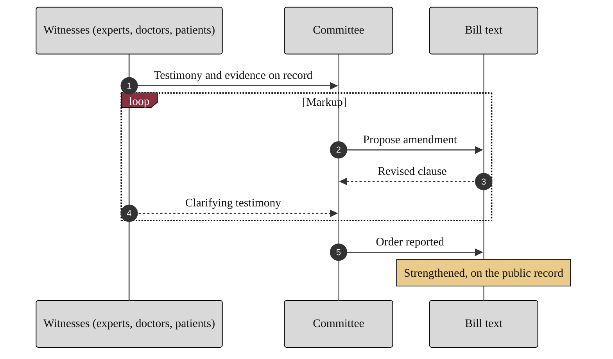
### 20. Patient Throughput: Legacy Versus Verified

How a cohort of patients flows to outcomes under the legacy path and under the
verified path, with the edge labels carrying the volume at each split. A weighted
flowchart is correct because it shows how work divides and converges while keeping
every color under the strict palette. Reproduced in the compiled LaTeX narrative
as a matching colored TikZ figure (palette: black, grayscales, #EBCB8B, #D08770,
#8B2E3F).

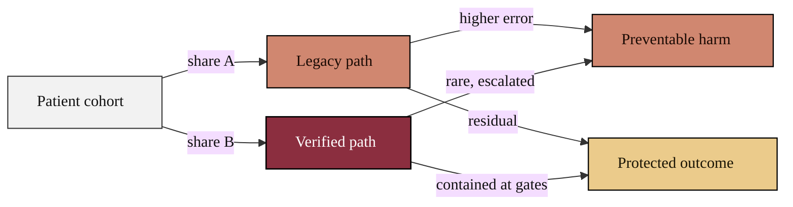
### 21. The National Platform Capstone

The capstone shows how the six-step verification baseline extends to a national
Physical AI oncology trial platform, grouped into four phases, define, build,
verify, and govern, with the Act binding the whole. A phase-grouped flowchart is
correct because it scales the model to many connected components while keeping the
flow fluent. Reproduced in the compiled LaTeX narrative as a matching colored TikZ
figure (palette: black, grayscales, #EBCB8B, #D08770, #8B2E3F).

```mermaid
%%{init: {'theme':'base','themeVariables':{'fontFamily':'Helvetica, Arial, sans-serif','lineColor':'#333333','primaryTextColor':'#111111','clusterBkg':'#F2F2F2','clusterBorder':'#888888'},'flowchart':{'curve':'basis','nodeSpacing':28,'rankSpacing':46,'htmlLabels':true}}}%%
flowchart LR
  subgraph PH1["Define"]
    direction TB
    REQ["Clinical specification"]:::n1
  end
  subgraph PH2["Build"]
    direction TB
    GEN["Claude Code generation"]:::n2
    REV["Codex peer review"]:::n2
  end
  subgraph PH3["Verify"]
    direction TB
    GATE{"Ten VVUQ gates"}:::act
    SAFE{"Subgroup safeguards"}:::act
  end
  subgraph PH4["Govern"]
    direction TB
    AUD[("Audit trail")]:::n3
    REP["Public report"]:::hope
    FUND["Authorized funding"]:::hope
  end
  ACT["H. R. 9510"]:::act
  REQ --> GEN --> REV --> GATE
  GATE --> SAFE --> AUD --> REP
  REP --> FUND
  ACT -.->|binds| GATE
  ACT -.->|binds| SAFE
  ACT -.->|requires| REP
  classDef act fill:#8B2E3F,stroke:#000000,stroke-width:1.4px,color:#ffffff
  classDef hope fill:#EBCB8B,stroke:#000000,stroke-width:1.2px,color:#1A1505
  classDef n1 fill:#F2F2F2,stroke:#333333,stroke-width:1.1px,color:#111111
  classDef n2 fill:#D9D9D9,stroke:#222222,stroke-width:1.1px,color:#111111
  classDef n3 fill:#BFBFBF,stroke:#000000,stroke-width:1.2px,color:#111111
```

---

## Notes

- All 21 figures keep the same strict palette so the set reads as one coherent,
  professional family: black, grayscales, and `#EBCB8B`, `#D08770`, `#8B2E3F`.
- Diagram types are varied so no two figures repeat the same pattern
  unnecessarily: flowchart, sequence, state, composite state, mindmap, journey,
  timeline, quadrant, and gitGraph.
- Boxes use a small 2 to 4 pixel corner radius and connectors use smooth splines
  (`basis`, `natural`, `cardinal`, `monotoneY`) so the figures read as formal
  exhibits for a legislative briefing, not cartoon cards.
- No raster image is used anywhere; each Markdown figure renders natively on
  GitHub and is reproduced as a colored TikZ figure in the compiled LaTeX.
- Single dashes only; black text on white backgrounds; no dark mode.
